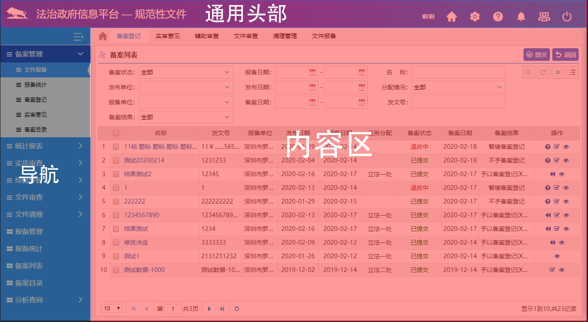
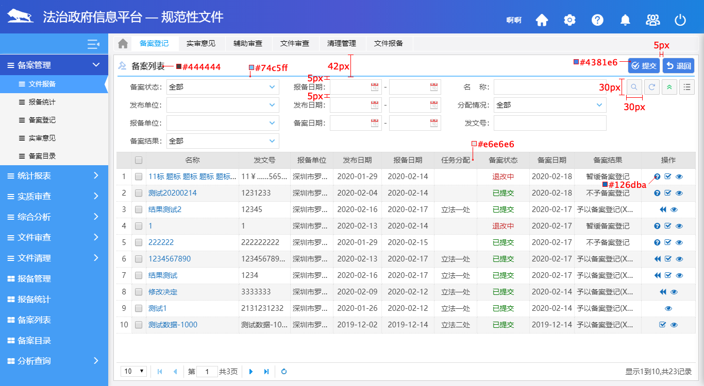
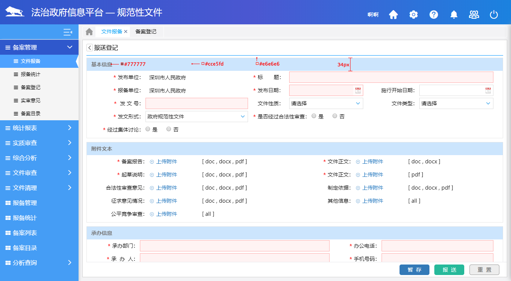

# 内容页
由`通用头部`、`导航`、`内容区`、`通用底部`共四个部分组成。

* 通用头部：由产品图标和产品名称组成
* 导航：图标和文字的组合形式，与右侧内容页联动
* 内容区：对左侧导航菜单的完整诠释，提供丰富的用户交互操作
* 通用底部：分内部产品和应用系统两种情况，具体请参考`内容页通用底部`

**举个** :chestnut:


## 通用头部
由`logo`、`平台/系统名称`、`用户名`、`设置`和`用户退出`共五个部分组成。

#### 其中`设置`包括：
   * 帮助：使用手册+业务引导图
   * 机构维护：机构信息
   * 用户维护：密码


## 内容区
### 首页
各项目产品首页的布局和内容都不相同，但是一般情况下都有以下几种元素：
* Echarts图表
* 轮播消息推送或通知公告
* 列表(要求数据量不大)
* 子菜单入口集合

### 一级列表页
#### 标题行
**1. 布局元素**

由`icon`、`标题`、`列表操作按钮`和`分隔条`四部分组成

**2. UI样式**
* 高度42px (上下各间距5px，分割线2px，内容30px，垂直居中)
* 左侧icon大小18px，颜色\#99BEF0
* 标题字体16px，加粗
* 列表操作按钮从右向左平铺，每个间距5px
* 分隔条高度2px，颜色#74c5ff
#### 查询条件
|  基本要求     | 排布 | 对齐 | 初始化 | 事件 |
| ------------ | -------------------------- | ------------------ | ------------------ | ------------------ |
| 查询条件都应包含在列表项中|条件大于等于5时，每行最多允许三个并列条件 | 所有条件lable右对齐，元素左对齐 |条件小于等于两行铺陈展示 |组合查询 |
| 一般要求条件与列表项顺序一致，实现中可根据具体情况进行调整| 条件小于等于4时，放一行 | 每行条件行距为5px|条件小于等于两行铺陈展示|回车事件|
| 按钮顺序：查询、重置、展开、自定义| 同种类型条件为一列| 左侧第一列左边距为0，即默认和上面标题行左对齐| | 条件清空|
| | 查询、重置按钮位置。参照规范性文件 | | |条件联动|

::: warning
此处表格各列无因果关系，互不影响
:::
#### 列表
由`表格`和`分页条`组成，使用`easyui`中`datagrid`控件
::: tip
具体要求请参考`通用组件规范`中`列表`
:::

**举个** :chestnut:


### 二级列表页
由`标题行`、`内容区`和`底部按钮`组成

#### 标题行
返回按钮+上一级页面名称
#### 内容区
1. 模块划分
* 模块边框1px 颜色#e6e6e6
* 标题栏背景色#cce5fd，高度34px，字体颜色#777、加粗、大小14px
2. 布局元素
* 每行不超过3个信息项
* 信息项label右对齐，内容左对齐
* 若内容为**日期**，统一使用`“yyyy-MM-dd`，如`2020-02-20`
#### 底部按钮
居右对齐

**举个** :chestnut:


## 通用底部
### 分类说明
   * 内部产品
      ```
      版权所有：北京北大软件工程股份有限公司
      ```
   * 应用系统
      ```
      版权所有：XXX司法厅（局） XXX信息中心   技术支持：北京北大软件工程股份有限公司
      ```
      
### UI样式
   * 字体：系统默认
   * 大小：12px
   * 颜色：#000000
   * 位置：居中