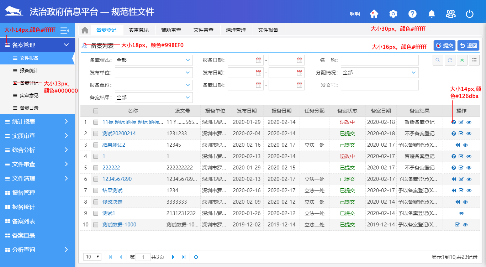

# icon规范

icon规范主要包含icon的大小和颜色，使用时严格按照以下参数：

|              | icon大小                   | icon颜色           |
| ------------ | -------------------------- | ------------------ |
| 通用头部icon | 30px                       | #fff               |
| 导航icon     | 一级菜单14px，二级菜单13px | 一级#fff，二级#000 |
| 标题行icon   | 18px                       | #99BEF0            |
| 功能按钮icon | 16px                       | #fff               |
| 列表操作icon | 14px                       | #126dba               |

::: tip
- 头部icon一般为矢量图片，设置图片高度为40px即可，宽度默认根据icon原尺寸成比例缩放。其他类型icon为font-awesome或者iconfont这种字体图标，通过设置字体大小font-size来规定大小。

- 导航菜单缩进后，一级菜单icon缩放倍数为1.7[scale(1.7)]， 二级菜单icon缩放倍数1.275倍[scale(1.275)]。
:::

**举个** :chestnut:
