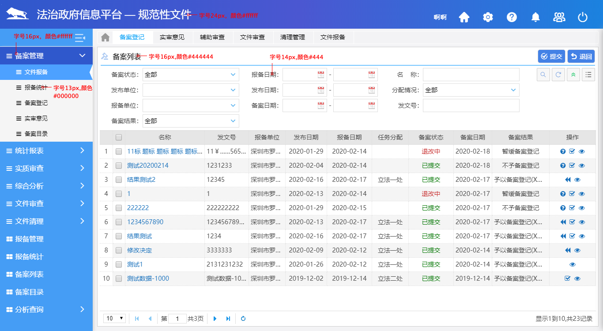

# 文字规范

文字规范主要包含文字的字体、大小、颜色以及行高，使用时严格按照以下参数：

|          | 字体           | 大小                       | 颜色                             |
| -------- | -------------- | -------------------------- | -------------------------------- |
| 系统名称 | 浏览器默认字体 | 24px                       | #fff                             |
| 导航名称 | 浏览器默认字体 | 一级菜单16px，二级菜单13px | 一级#fff，二级#000，二级选中#fff |
| 一级标题 | 浏览器默认字体 | 16px                       | #444                             |
| 二级标题 | 浏览器默认字体 | 15px                       | #777                             |
| 文本     | 浏览器默认字体 | 14px                       | #444                             |

**举个** :chestnut:
