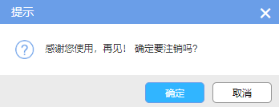

# 按钮

## 一级列表按钮

### 按钮类型

一级列表页中按钮分为**优先操作按钮、次要操作和不常用及批量操作按钮**。

- 优先操作按钮举例：新增、删除、提交
- 次要操作按钮例如：撤回、下载
- 不常用及批量操作按钮例如：导出

### 摆放顺序

同时出现时按照**通用、单项、批量**的顺序**从左至右**摆放。

### 按钮样式

- 形式：采用图标+文字形式
- 大小：easyui-button默认大小
- 配色：以#4381e6背景色，#ffffff字体色为主
- 间距：按钮内图标和文字间距5px，每个按钮之间的间距5px
- 使用方法举例：

```html
<button class="easyui-linkbutton" onclick="click();">
	<i class="iconfont icon-lianxiang"></i> 登&nbsp;&nbsp;记
</button>
```


## 二级功能页按钮

### 按钮类型

二级功能页中按钮分为操作按钮及内容按钮，其中操作按钮分为页面返回按钮和底部操作按钮

### 摆放顺序

一般只有底部操作按钮涉及摆放顺序，规则如下：

### 按钮样式

#### 页面返回按钮

- 位置：置于页面标题行文字前
- 内容：字体图标icon-arrow-left
- 大小：16px
- 边框：#cfcfcf
- 间距：右外边距5px
- 使用示例

```html
<span class='iconfont icon-arrow-left' onclick="back();"></span>
```

#### 底部操作按钮

- 举例：暂存、提交、重置
- 形式：仅文字
- 大小：80px*28px
- 位置：固定页面底部，局右对齐
- 配色：以下提供几个常用按钮的配色方案

|      | 边框颜色 | 背景色  | 文字颜色 |
| ---- | -------- | ------- | -------- |
| 暂存 | #3379b7  | #3379b7 | #fff     |
| 提交 | #26b99a  | #26b99a | #fff     |
| 重置 | #969696  | #ededed | #666666  |

- 字体大小：16px
- 边框弧度：5px
- 使用示例：

```html
<input type="button" onclick="reset();" class="btn-win-white" title="重置" /> 
<input type="button" onclick="save();" class="btn-win-white" title="保存" /> 
<input type="button" onclick="push();" class="btn-win-white" title="提交" />
```


## 弹框按钮

**举个**:chestnut:



### 按钮样式

框架弹框自带按钮

### 摆放顺序

保存/确认/提交在左，取消在右