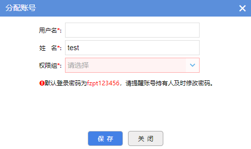

# 弹框

## 弹框选用标准

依照下表，根据具体情况选择合适的弹框

|                        |                适用情况                |     大小     |
| :--------------------: | :------------------------------------: | :----------: |
|         大弹框         |    填写复杂的表单或者复杂的查看内容    | 1100px*600px |
|         中弹框         |   操作步骤多于两项，查看内容相对较少   | 800px*450px  |
|         小弹框         |     操作步骤小于等于两项，步骤单一     | 500px*300px  |
|  提示性弹框（带按钮）  |          展示简单的提示性内容          | 框架默认大小 |
| 提示性弹框（不带按钮） | 展示简单提示性内容，显示几秒后自动消失 | 框架默认大小 |

## 弹框代码示例

### 大/中/小弹框

大中小弹框的使用方式相同，仅需要按照标准修改参数width和height，以下附上小弹框的代码示例：



```javascript
bsWindow(url, title, {
        width: "1100",
        height: "600",
        buttons: [{
                name: "保存",
                classStyle: "btn-alert-blue"
            },
            {
                name: "关闭",
                classStyle: "btn-alert-gray"
            }
        ],
        submit: function(v, h) {
            if (v == "保存") {
                var result = h[0].contentWindow;
                var result = result.commit();
                if (result) {
                    location.reload();
                    return true;
                }
            }
            if (v == "关闭") {
                return true;
            }
        }
    }
);
```

### 提示性弹框

- 不带按钮提示框使用示例如下：


```javascript
$.MsgBox.Alert_auto("请选择一个案件！");
```

- 带按钮提示框使用示例如下：


```javascript
$.MsgBox.Confirm("提示", "是否撤销并案?", function() {});
```

