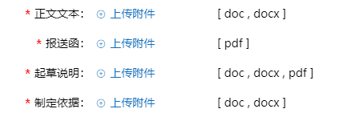

# 附件上传控件

## 控件格式

图标 + 文字 + 类型



:::tip

上传成功后，应显示文件名，鼠标悬浮至文件名时应有对操作文件选项面板

:::


## 示例代码

### 前台代码

```html
<a id="a203022UploadHolder" class="add_swfupload">
    <i class="iconfont icon-add"></i>上传附件
</a>
<input id="a203022" type="hidden" value="${registerModel.a203022}"/>
<div id="a203022FileContainer">
    <span>[ doc , docx , pdf ]</span>
</div>
```

### 后台代码

::: tip

相关后台代码请参照oaop框架自带附件上传功能

:::