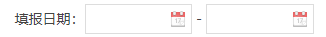

# 表单

## 格式

必填项标识 + 信息项文字(label) + 中文冒号 + 相应表单控件

## 控件使用规范

- 除了单选、多选按钮使用原生控件外，其他控件选用easyui表单控件
- 下拉框选项面板高度应为实际选项高度之和，底部不留白
- 如有日期范围的选择，两个日期框之间统一用“-”短线，不用文字

## label规范

统一使用中文格式的冒号，且必填项在label文字前添加红色*号

## 表单控件代码示例

#### Input 输入框


```html
<input class="easyui-textbox" name="name1" id="" /> 
```

#### Combobox 组合框


```html
<input name="11" id="sex" class="easyui-combobox" 
			data-options="data:[{value:'0',text:'全部'},{value:'1',text:'待报送'},{value:'2',text:'已报送'}],panelHeight:'auto', editable:false" />
```

#### Datebox 日期框



```html
<div>
    <input id="startDate" class="easyui-datebox" name="startDate" style="width:45%;"/>
	<span class='form-zhi'>-</span>
	<input id="endDate" class="easyui-datebox" name="endDate" validtype="compareTime['#startDate']" style="width:45%;"/>
</div>
```

#### 单选按钮


```html
<span>是否经过合法性审查：</span>
<label><input type="radio" name="a203031" value="1" checked="checked"/>是</label>
<label><input type="radio" name="a203031" value="0" style="margin-left:10px"/>否</label>
```

#### 复选按钮


```html
<span>履行程序情况：</span>
<label><input type="checkbox" name="a20101008" value="01"/>领导签批或集体讨论</label>
<label><input type="checkbox" name="a20101008" value="02" />风险评估</label>
<label><input type="checkbox" name="a20101008" value="03" />专家论证</label> 
<label><input type="checkbox" name="a20101008" value="04" />公平竞争审查</label>
```

