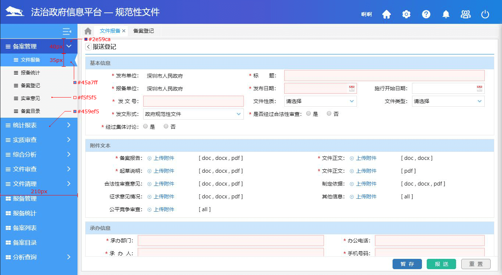

# 侧边导航菜单

## 基本原则

导航最多不超过三级。

## 状态

默认呈展开状态，可折叠。

## 尺寸

展开时宽度210px，收起时宽度70px

## 样式规范

|          | 高度 |               背景色               |   内容    |
| :------: | :--: | :--------------------------------: | :-------: |
| 一级菜单 | 40px | 未选中背景色#459df4，选中后#2e59ca | icon+名称 |
| 二级菜单 | 35px | 未选中背景色#f5f5f5，选中后#45a7ff | icon+名称 |

