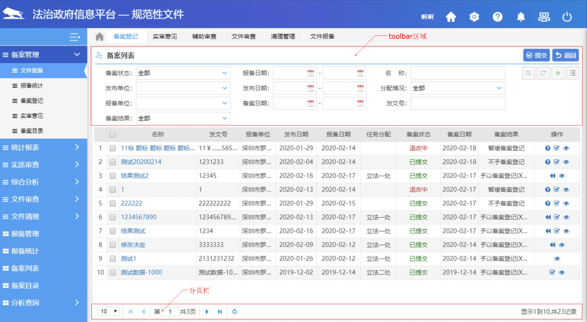
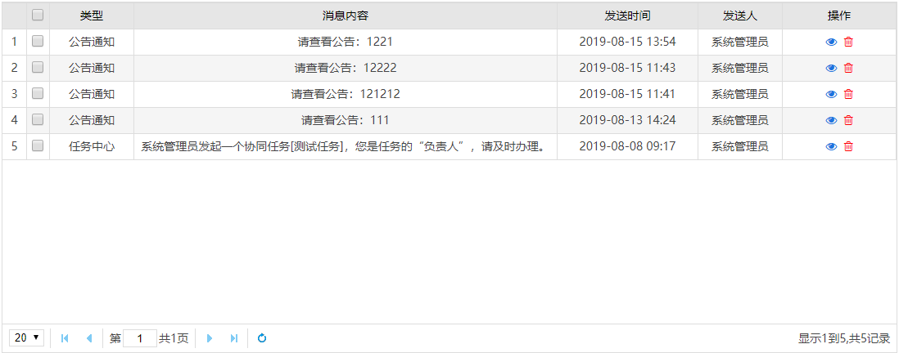
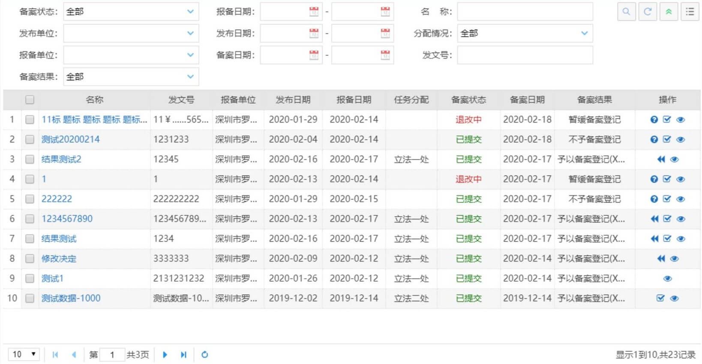

# 列表

## 表头

表头文字居中

## 表身

各列表项对齐方式见下表：

|                | 对齐方式 |             示例             |
| :------------: | :------: | :--------------------------: |
|     代码表     |   居中   |       单位名称、性别等       |
|      状态      |   居中   |          审核状态等          |
|      日期      |   居中   |   提交日期（yyyy-MM-dd）等   |
|      操作      |   居中   | 删除、查看等（使用统一图标） |
| 长度一致的文本 |   居中   |       手机号码、邮箱等       |
|      整数      |  右对齐  |       暂扣营业执照天数       |
|     浮点型     |  右对齐  |                              |
|    其他文本    |  左对齐  |          除以上类型          |

## 分页

默认展示20条数据。分页条中每页的行数统一设置为10、20、50、100

## 列表滚动条

在datagrid配置项中设置列表滚动条宽度为0，列表会根据内容是否超出显示区域自动加载滚动条。

::: tip
`scrollbarSize : 0`
:::

## 工具栏

toolbar区域的内容为本页标题栏以及查询条件。查询条件统一使用**文本框/下拉框/日期框**进行列表筛选（**禁用使用tab切换不同列表**）



## 列表项自定义

### 功能说明

该功能能够自定义列表内容，用户可以在选择面板上自行勾选需要展示的列表项。


### 使用方法

:::tip

需引入以下文件

```html
<script type="text/javascript" src="/xzfy/js/base/juicer-min.js"></script>
```

:::

::: details 点击查看代码

```html
<span class="optionarea">
	<i class="isshow iconfont icon-list" id="optionalcolumnBtn"></i>
	<ul class="panList"></ul>
</span>
```

```js
//可选项列表(仅列举一部分)
var listdata = {
    isShowColumn: [{
            codeNo: 'opt_caseNum',
            codeName: '案件编号'
        },
        {
            codeNo: 'sysNo',
            codeName: '系统流水号'
        },
        {
            codeNo: 'opt_name',
            codeName: '申请人'
        },
        {
            codeNo: 'oth_name',
            codeName: '其他申请人'
        }
    ]
}

//列表默认展示项
var temp = ['opt_caseNum', 'opt_name', 'mergerCase', 'remainderTime'];

//初始化可选项面板
function initOptionalList() {
    var i = 0;
    if (column[0].length % 7 == 0) {
        i = column[0].length / 7;
    } else {
        i = Math.ceil(column[0].length / 7)
    }
    var widthnum = i * 190 + 10;
    var width = widthnum + 'px';
    $(".panList").css("width", width);
    //绑定点击事件
    $(".isshow").on("click", function() {
        $(".panList").show();
        $("body").append('<div id="panListBack" class=""></div>');
    });
    $("body").delegate("#panListBack", "click", function() {
        $(".panList").hide();
        $("#panListBack").remove();
    });
}

//可选列选项点击事件 追加队勾 
function detail(code, th) {
    if ($(th).children('i').hasClass("fa-check")) {
        $(th).children('i').removeClass("fa-check");
        $('#datagrid').datagrid('hideColumn', code);
        for (var i = 0; i < temp.length; i++) {
            if (temp[i] == code) {
                temp.splice(i, 1);
                break;
            }
        }
    } else {
        $(th).children('i').addClass("fa-check");
        $('#datagrid').datagrid('showColumn', code);
        temp.push(code);
    }
}

//可选列 模板引擎加载
var tpl = [
    '{@each isShowColumn as it,index}',
    '{@if index==0}',
    '<li id=\'${it.codeNo}\'><i class="fa"></i>${it.codeName}</li>',
    '{@else}',
    '<li onclick="detail(\'${it.codeNo}\',this)" id=\'${it.codeNo}\' ><i class="fa"></i>${it.codeName}</li>',
    '{@/if}',
    '{@/each}'
].join('\n');

//初始化中使用加载可选列面板
function doInit() {
    //可选列加载
    $(".panList").html("");
    $(".panList").append(juicer(tpl, listdata));
}

//初始化判断默认列，并添加对勾
    datagrid = $('#datagrid').datagrid({
        url: url,
        queryParams: {
            type: type,
            isNeedDeal: isNeedDeal,
            //caseNum: $('#caseNum').textbox("getValue"),
            name: $('#name').textbox("getValue"),
            respName: $('#respName').textbox("getValue"),
            start: $('#findbeaginDate').datebox("getValue"),
            end: $('#findendDate').datebox("getValue"),
            postType: $('#postType').textbox("getValue")
        },
        view: window.EASYUI_DATAGRID_NONE_DATA_TIP,
        pagination: true,
        singleSelect: false,
        toolbar: '#toolbar',
        checkbox: true,
        border: false,
        idField: 'caseId',
        striped: true,
        onLoadSuccess: function(data) {
            if (temp.length > 0) {
                for (var i = 0; i < temp.length; i++) {
                    $('#datagrid').datagrid('showColumn', temp[i]);
                    if (!$('#' + temp[i]).children('i').hasClass("fa-check")) {
                        $('#' + temp[i]).children('i').addClass("fa-check");
                    }
                }
            }
        },
        frozenColumns: frozenColumn,
        columns: column
    })
}
```

:::

## 代码规范

### 基础表格



:::details 点击查看基础表格的代码规范

```html
<table id="datagrid"></table>
```

```javascript
/**
 * @description 初始化 非弹出表格(包含规范化后部分样式)
 * @param {String} actionUrl 接口的url
 * @param {String} columns 表格列的设置信息
 * @param {String} isPagination 是否分页
 * @param {String} isRowNumber 是否显示行号
 * @param {String} domId 表格table的选择器ID
 */
function doInitBaseTable(actionUrl, columns, isPagination, isRowNumber, domId) {
    var datagrid = $('#' + domId).datagrid({
        url: actionUrl || "",
        pagination: isPagination,
        view: window.EASYUI_DATAGRID_NONE_DATA_TIP, // 加载样式(查询不到数据)
        border: false,
        striped: true,
        idField: 'uuid', // 主键列
        pageSize: 20,
        pageList: [10, 20, 50, 100],
        rownumbers: isRowNumber, // 行号
        SingleSelect: true, // 是否选中多条
        nowrap: true, // 数据长度超出列宽时将会自动截取。
        fitColumns: true, // 列是否进行自动宽度适应
        scrollbarSize: 0,
        columns: columns
    });
    return datagrid;
}

var columns = [
    [{
        field: 'smsSid',
        title: '',
        width: 50,
        checkbox: true
    }, {
        field: 'moduleNoDesc',
        title: '类型',
        width: 30,
        align: 'center'
    }, {
        field: 'content',
        title: '消息内容',
        width: 150,
        align: 'center'
    }, {
        field: 'sendTimeDesc',
        title: '发送时间',
        width: 50,
        align: 'center'
    }, {
        field: 'fromUser',
        title: '发送人',
        width: 30,
        align: 'center'
    }, {
        field: '_manage',
        title: '操作',
        width: 40,
        align: 'center',
        formatter: function (value, rowData, rowIndex) {
            var opt ="<i class='fa fa-eye blueColor' onclick=\"viewDetail('"+rowData.smsSid+"')\" value='详情'></i>";
            opt = opt +
                "&nbsp;&nbsp;<i class='fa fa-trash-o redColor' value='删除' onclick=\"deleteSmsList('"+rowData.smsSid+"')\"></i>";
            return opt;
        }
    }]
];
var datagrid;

function doInit() {
    datagrid = doInitBaseTable(contextPath + '/sms/getSmsBoxDatas.action', columns, true, true, "datagrid");
}
```

:::

### 可搜索表格



::: details 点击查看可搜索表格的代码规范

```html
<table id="datagrid" fit="true"></table>
```

```javascript
/**
 * @description 初始化有查询条件 非弹出表格(包含规范化后部分样式)
 * @param {String} actionUrl 接口的url
 * @param {String} columns 表格列的设置信息
 * @param {String} isPagination 是否分页
 * @param {String} isRowNumber 是否显示行号
 * @param {String} domId 表格table的选择器ID
 */
function doInitSearchTable(actionUrl, columns, isPagination, isRowNumber, domId, param) {
    var datagrid = $('#' + domId).datagrid({
        url: actionUrl,
        toolbar: '#toolbar',
        queryParams: param,
        view: window.EASYUI_DATAGRID_NONE_DATA_TIP,
        singleSelect: true,
        pagination: isPagination,
        pageSize: 20,
        pageList: [10, 20, 50, 100],
        fitColumns: true,
        scrollbarSize: 0, //规定列表滚动条宽度为0
        nowrap: true,
        border: false,
        striped: true,
        columns: columns,
        rownumbers: isRowNumber, // 行号
        onLoadSuccess: function () {}
    });
    return datagrid;
}

var columns = [
    [{
        field: 'smsSid',
        title: '',
        width: 50,
        checkbox: true
    }, {
        field: 'moduleNoDesc',
        title: '类型',
        width: 30,
        align: 'center'
    }, {
        field: 'content',
        title: '消息内容',
        width: 150,
        align: 'center'
    }, {
        field: 'sendTimeDesc',
        title: '发送时间',
        width: 50,
        align: 'center'
    }, {
        field: 'fromUser',
        title: '发送人',
        width: 30,
        align: 'center'
    }, {
        field: '_manage',
        title: '操作',
        width: 40,
        align: 'center',
        formatter: function (value, rowData, rowIndex) {
            var opt ="<i class='fa fa-eye blueColor' onclick=\"viewDetail('"+rowData.smsSid+"')\" value='详情'></i>";
            opt = opt +
                "&nbsp;&nbsp;<i class='fa fa-trash-o redColor' value='删除' onclick=\"deleteSmsList('"+rowData.smsSid+"')\"></i>";
            return opt;
        }
    }]
];

var datagrid;

function doInit() {
    var param = {};
    //以下是查询条件
    param["moduleNo"] = $("#classify").val();
    param["remindFlag"] = $("#remindFlag").val();
    datagrid = doInitSearchTable(contextPath + '/sms/getSmsBoxDatas.action', columns, true, true, "datagrid", param);
    
}

function query() {
    var param = {};
    param["moduleNo"] = $("#classify").val();
    param["remindFlag"] = $("#remindFlag").val();
    datagrid.datagrid('reload',param);
}
```

:::

